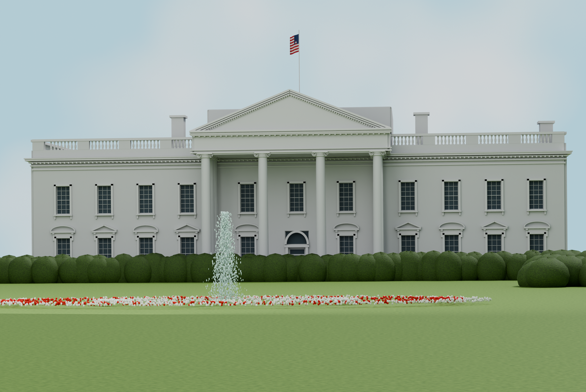
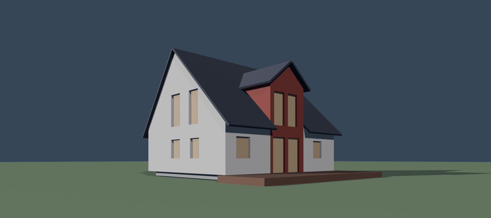
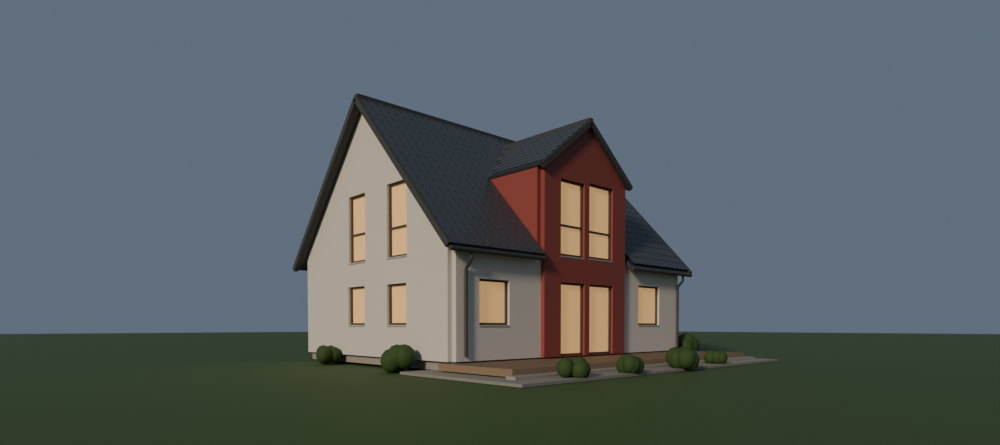

# Photo to BIM

Turn one building photograph into a semantic IFC model and a comparison render,
using Codex or Claude Code, Blender, and Bonsai.

| Reference photograph | IFC reconstruction |
| --- | --- |
|  |  |

[Download this IFC and read its assumptions](examples/white-house/README.md).
Reference: Nishkid64, colour correction by Patrickneil, public domain.

## Use it

**First time?** Install the Blender dependencies below, then give your local Codex
or Claude Code agent this request:

> Read https://github.com/alekseikondratenko/photo-to-bim and its installation guide.
> Install Photo to BIM for my user account so it is available across projects.
> Check the required dependencies and help me install any that are missing.
> Configure Blender MCP if it is not already configured. Preserve my existing
> settings, verify both MCP connections, and tell me any Blender steps I must do
> myself. Do not start a reconstruction yet.

Or follow the [copy-and-paste installation commands](docs/installation.md).
Installation is for a local client on the computer running Blender. A cloud agent
cannot reach your computer's `localhost` without additional infrastructure.

**For each building:**

1. Create a new working folder, add the photograph, and open that folder in Codex
   or Claude Code. Start a fresh task after installing the plugin.
2. Open Blender with Bonsai enabled. Start the Blender MCP server in its sidebar
   and **leave Blender open** while the agent works.
3. Send:

   > Create an IFC model of the building in this photograph using Blender and Bonsai.

The skill supplies the IFC hierarchy, metre units, appropriate element classes,
proportion and façade matching, assumptions, efficient repeated components, and
validation. Default outputs are `house.ifc`, `comparison.png` from the photo's
viewpoint, and supporting evidence in the working folder. You can request other
filenames or outputs and add your own file-access constraints to the prompt.

You do not need to pre-create `PROMPT.txt`, `SETUP.md`, a runtime manifest, Python
scripts, or hidden configuration folders in each project. Those were fixtures for
our isolated development tests. A normal user installation is reused across
projects; modelling scripts and evidence are created as needed during the task.

## Install Blender and its add-ons once

1. **[Download Blender](https://www.blender.org/download/)** — free and open source.
   Use a Blender version supported by your Bonsai release.
2. **[Install Bonsai](https://docs.bonsaibim.org/quickstart/installation.html)** —
   the IFC authoring add-on. In **Edit → Preferences → Get Extensions**, search
   for Bonsai and install it. If Blender prompts for **Allow Online Access**,
   allow it to download extensions. If no prompt appears, continue; it is not a
   separate mandatory step. Confirm Bonsai is enabled under **Add-ons**.
3. **[Install Blender MCP](https://github.com/ahujasid/blender-mcp)** — the bridge
   into Blender. Download [`addon.py`](https://github.com/ahujasid/blender-mcp/blob/main/addon.py)
   from that repository. In Blender's **Preferences → Add-ons**, choose
   **Install from Disk…** from the menu (or **Install…** in older versions), select
   the file, and enable **MCP for Blender** / **Blender MCP**.
4. In the 3D Viewport, press **N**, open the **BlenderMCP** tab, and click its
   server-start button (labelled **Start MCP Server** or **Connect** depending on
   the add-on version). Start it again after restarting Blender.

The client also needs **Node.js 22+**, **uv/uvx**, and a Python version supported
by Blender MCP (currently **3.10+**). `uv` can manage that Python interpreter;
Blender has its own Python, and Bonsai supplies its IFC libraries inside Blender.
See [dependencies and client setup](docs/installation.md). This plugin ships its
own measurement server; it does **not** distribute Blender, Bonsai, or Blender MCP.

## Examples

These are selected development runs, made with the plugin version recorded in
each example. They demonstrate outputs, not a controlled speed comparison or a
claim of survey accuracy. IFC validity and photographic agreement are reported
separately; none of these runs has independent held-out landmarks.

| Example | Files and evidence | Recorded result |
| --- | --- | --- |
| White House · test 19 | [Photo, render, IFC, assumptions](examples/white-house/README.md) | IFC, fitted landmarks and appearance passed |
| Empire State Building · test 16 | [Photo, render, IFC, assumptions](examples/empire-state/README.md) | IFC and appearance passed; photographic fit needs refinement |
| Taipei 101 · test 11 | [Photo, render, IFC, assumptions](examples/taipei-101/README.md) | IFC, fitted landmarks and appearance passed |
| Red-roof house · test 9 | [Render, IFC, assumptions](examples/red-roof-house/README.md) | IFC and fitted landmarks passed; appearance evidence incomplete |

### Earlier house runs

| Claude Code · Fable 5.1 | Codex · Astra |
| --- | --- |
|  |  |
| About **30 minutes** of active work, as reported by the author; idle gaps excluded. | About **8–9 minutes** to this displayed draft. |

These images come from different runs and plugin versions. The Codex image is a
**draft**, not its later final deliverable. Time varies with the subject, model,
hardware, detail and interruptions. [Run notes](examples/early-runs/README.md).

## Design decisions and limits

- **One photo is the input.** The visible proportions, silhouette, façade and
  viewpoint guide the reconstruction. Building recognition is not required.
- **Unseen geometry is inferred.** The agent makes a simple, coherent continuation
  of the observed form, including plausible openings and materials where
  appropriate. These are documented assumptions, not recovered facts. It avoids
  unsupported major additions and invented unseen interiors.
- **Dimensions need an assumed or supplied scale.** Real metre units do not make
  photo-derived dimensions measured survey data.
- **The output is semantic IFC.** A project/site/building/storey hierarchy contains
  appropriate typed elements, including curtain walls when applicable. Repeated
  components can share geometry while retaining IFC identity.
- **Evidence has limits.** IFC validation, appearance checks and photographic
  fit are separate. A good render or fitted-landmark pass does not prove hidden
  geometry, independent accuracy or interoperability with every BIM application.
- **The goal is repeatable authoring.** The skill gives a common method and the
  tools provide measurements. We have not established a speed advantage over a
  capable agent using Blender alone. See the optional [benchmark protocol](benchmarks/README.md).

## For developers

[Installation and troubleshooting](docs/installation.md) ·
[Repository layout, Python helpers and tests](docs/development.md) ·
[Measurement MCP](mcp/README.md) · [Example credits](examples/README.md)

Code is licensed under [Apache-2.0](LICENSE). Reference images have separate
credits and terms; see [NOTICE](NOTICE) and the individual examples.
