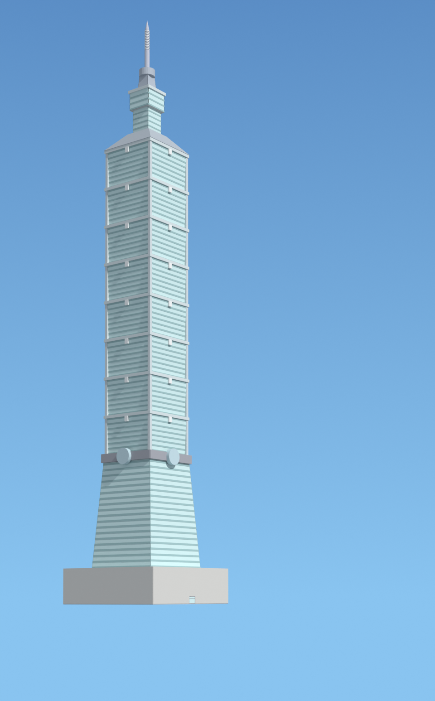
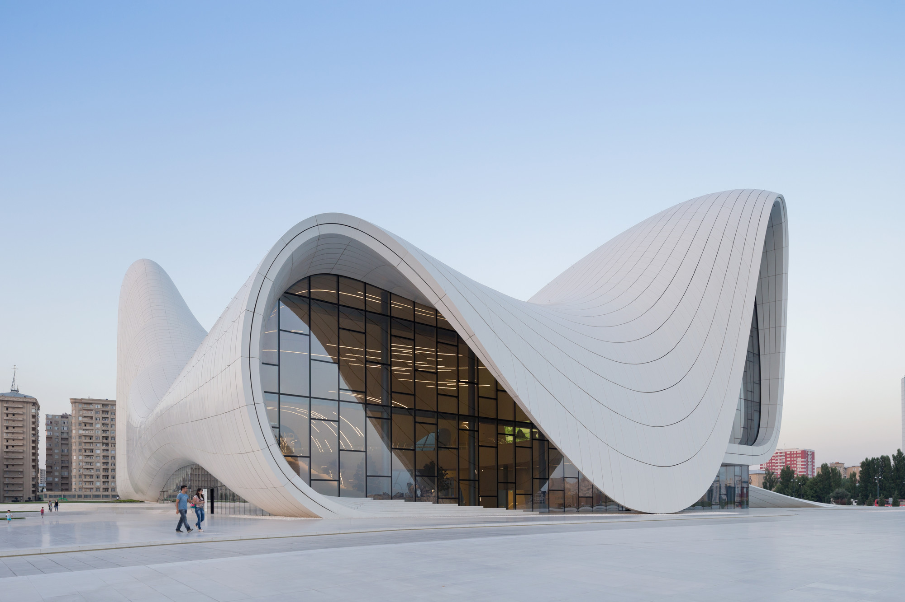
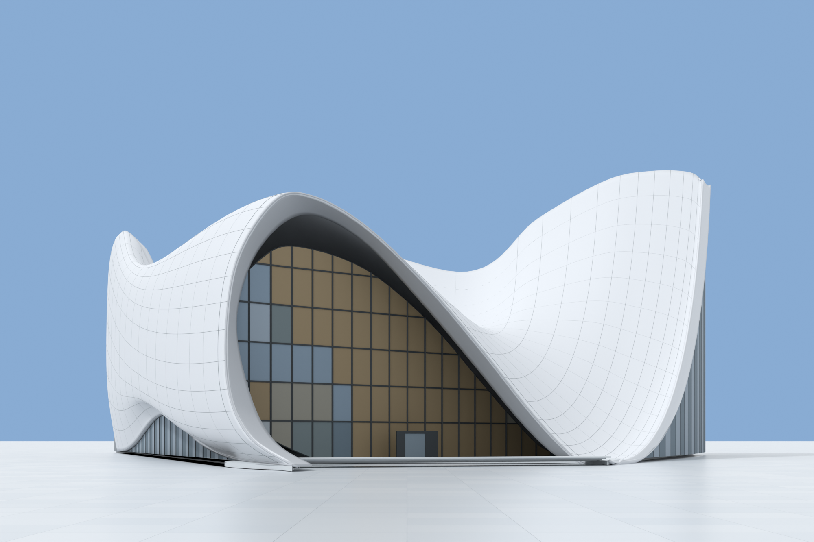

# Photo to BIM

Turn one building photograph into a semantic IFC model and a comparison render,
using Codex or Claude Code, Blender, and Bonsai.

| Reference photograph | IFC reconstruction |
| --- | --- |
|  |  |

[Download this IFC and read its assumptions](examples/white-house/README.md).
Reference: Nishkid64, colour correction by Patrickneil, public domain.

## Use it

**First time?** Install the Blender dependencies below, then give your local Codex
or Claude Code agent this request:

> Read https://github.com/alekseikondratenko/photo-to-bim and its installation guide.
> Install Photo to BIM for my user account so it is available across projects.
> Check the required dependencies and help me install any that are missing.
> Configure Blender MCP if it is not already configured. Preserve my existing
> settings, verify both MCP connections, and tell me any Blender steps I must do
> myself. Do not start a reconstruction yet.

Or follow the [copy-and-paste installation commands](docs/installation.md).
Installation is for a local client on the computer running Blender. A cloud agent
cannot reach your computer's `localhost` without additional infrastructure.

**After installation, restart Codex or Claude Code—whichever you use—then open a fresh task.**

**For each building:**

1. Create a new working folder, add the photograph, and open that folder in Codex
   or Claude Code.
2. Open Blender with Bonsai and Blender MCP enabled, and **leave Blender open**
   while the agent works.
3. Send:

   > Create an IFC model of the building in this photograph using Blender and Bonsai.

The skill supplies the IFC hierarchy, metre units, appropriate element classes,
proportion and façade matching, assumptions, efficient repeated components, and
validation. Default outputs are `house.ifc`, `comparison.png` from the photo's
viewpoint, and supporting evidence in the working folder. You can request other
filenames or outputs and add your own file-access constraints to the prompt.

You do not need to pre-create `PROMPT.txt`, `SETUP.md`, a runtime manifest, Python
scripts, or hidden configuration folders in each project. Those were fixtures for
our isolated development tests. A normal user installation is reused across
projects; modelling scripts and evidence are created as needed during the task.

## Install Blender and its add-ons once

1. **[Download Blender](https://www.blender.org/download/)** — free and open source.
   Use a Blender version supported by your Bonsai release.
2. **[Install Bonsai](https://docs.bonsaibim.org/quickstart/installation.html)** —
   the IFC authoring add-on. In **Edit → Preferences → Get Extensions**, search
   for Bonsai and install it. If Blender prompts for **Allow Online Access**,
   allow it to download extensions. If no prompt appears, continue; it is not a
   separate mandatory step. Confirm Bonsai is enabled under **Add-ons**.
3. **[Install Blender MCP](https://github.com/ahujasid/blender-mcp)** — the bridge
   into Blender. Download [`addon.py`](https://github.com/ahujasid/blender-mcp/blob/main/addon.py)
   from that repository. In Blender's **Preferences → Add-ons**, choose
   **Install from Disk…** from the menu (or **Install…** in older versions), select
   the file, and enable **MCP for Blender** / **Blender MCP**.

The current Blender MCP add-on starts its server automatically by default when
enabled and when Blender opens. Install and enable it once; no manual connection
step is needed for each photograph. If it does not connect, see
[troubleshooting](docs/installation.md#troubleshooting) for older versions or
disabled auto-start.

The client also needs **Node.js 22+**, **uv/uvx**, and a Python version supported
by Blender MCP (currently **3.10+**). `uv` can manage that Python interpreter;
Blender has its own Python, and Bonsai supplies its IFC libraries inside Blender.
See [dependencies and client setup](docs/installation.md). This plugin ships its
own measurement server; it does **not** distribute Blender, Bonsai, or Blender MCP.

## Simple Benchmark Testing

### Taipei 101: one photograph, two agents

<table>
  <tr>
    <th width="33%">Original photograph</th>
    <th width="33%">Claude Code · Fable 5.1</th>
    <th width="33%">Codex · Astra</th>
  </tr>
  <tr>
    <td></td>
    <td></td>
    <td></td>
  </tr>
  <tr>
    <td>Same input photograph</td>
    <td>About <strong>30 minutes</strong></td>
    <td>About <strong>9 minutes</strong></td>
  </tr>
</table>

Both runs used plugin 0.8.3. The Claude model is shown with
blue-sky lighting applied afterwards, preserving its IFC geometry, colours and
original camera. The original Claude render is retained in the run notes.
Times are approximate: Claude is rounded from its session log; Codex is the
author’s reported estimate. The later presentation render is excluded. These are
illustrative runs, not a controlled speed comparison. [Run notes](examples/taipei-comparison/README.md).

Reference: AngMoKio, edited by Mylius,
[CC BY-SA 3.0](https://creativecommons.org/licenses/by-sa/3.0/),
[original source](https://commons.wikimedia.org/wiki/File:Taipei_101_2009_amk-EditMylius.jpg).

### Curved forms: Heydar Aliyev Center

| Reference photograph | Codex IFC reconstruction |
| --- | --- |
|  |  |

The curved roof and main opening are reproduced; glazing reflections, panel
spacing and the right-hand return are simplified. Hidden depth remains assumed.
[IFC, assumptions and details](examples/heydar-aliyev-center/README.md).
Reference: © Iwan Baan, via
[ArchDaily](https://www.archdaily.com/448774/heydar-aliyev-center-zaha-hadid-architects).
The reference photograph is not covered by this repository's software licence.

### More examples

These are selected development runs, made with the plugin version recorded in
each example. They demonstrate outputs, not a controlled speed comparison or a
claim of survey accuracy. IFC validity and photographic agreement are reported
separately; fitted-landmark agreement alone does not establish independent accuracy.

| Example | Files and evidence | Recorded result |
| --- | --- | --- |
| White House | [Photo, render, IFC, assumptions](examples/white-house/README.md) | IFC, fitted landmarks and appearance passed |
| Empire State Building | [Photo, render, IFC, assumptions](examples/empire-state/README.md) | IFC and appearance passed; photographic fit needs refinement |
| Taipei 101 | [Photo, render, IFC, assumptions](examples/taipei-101/README.md) | IFC and appearance passed; photographic fit needs refinement |
| Heydar Aliyev Center | [Render, IFC, assumptions](examples/heydar-aliyev-center/README.md) | Curved roof shells and curtain walls; hidden depth remains assumed |

## Design decisions and limits

- **One photo is the input.** The visible proportions, silhouette, façade and
  viewpoint guide the reconstruction. Building recognition is not required.
- **Unseen geometry is inferred.** The agent makes a simple, coherent continuation
  of the observed form, including plausible openings and materials where
  appropriate. These are documented assumptions, not recovered facts. It avoids
  unsupported major additions and invented unseen interiors.
- **Dimensions need an assumed or supplied scale.** Real metre units do not make
  photo-derived dimensions measured survey data.
- **The output is semantic IFC.** A project/site/building/storey hierarchy contains
  appropriate typed elements, including curtain walls when applicable. Repeated
  components can share geometry while retaining IFC identity.
- **Evidence has limits.** IFC validation, appearance checks and photographic
  fit are separate. A good render or fitted-landmark pass does not prove hidden
  geometry, independent accuracy or interoperability with every BIM application.
- **The goal is repeatable authoring.** The skill gives a common method and the
  tools provide measurements. We have not established a speed advantage over a
  capable agent using Blender alone. See the optional [benchmark protocol](benchmarks/README.md).

## Directions

Directions under consideration, not commitments; the repository's behaviour is
what its current version documents.

- **Multiple photographs.** A second viewpoint constrains the depth axis that a
  single photo leaves soft, and opens interiors. The landmark machinery with
  stable observation IDs is the intended substrate for cross-photo fusion.
- **Supplied measurements.** A laser-measured wall or door entered as a
  `measured` scale anchor should upgrade dependent dimensions from assumed to
  measured, with the uncertainty labels propagating. One real measurement is
  the cheapest large accuracy gain available.
- **Held-out validation as routine.** Recent runs declare independent held-out
  landmarks; making that the default for every run is the standing goal for
  the evidence side.

## For developers

[Installation and troubleshooting](docs/installation.md) ·
[Repository layout, Python helpers and tests](docs/development.md) ·
[Measurement MCP](mcp/README.md) · [Example credits](examples/README.md)

Code is licensed under [Apache-2.0](LICENSE). Reference images have separate
credits and terms; see [NOTICE](NOTICE) and the individual examples.

## Related Work

[Photo to Three.js](https://github.com/alekseikondratenko/photo-to-threejs) —
reconstruct buildings from photographs as procedural Three.js models.
