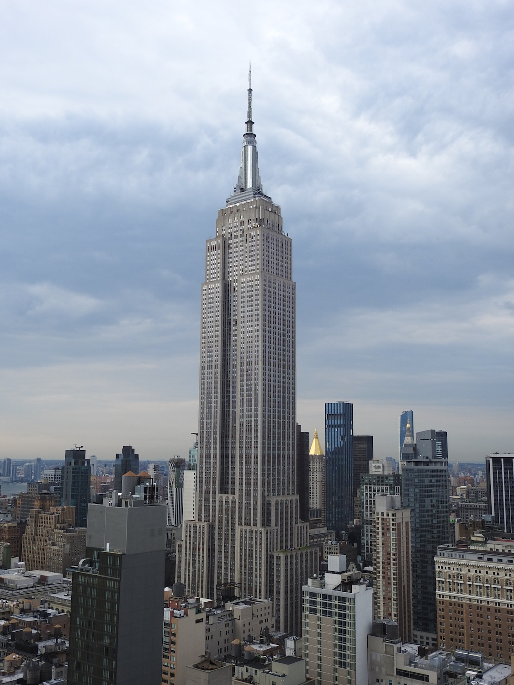
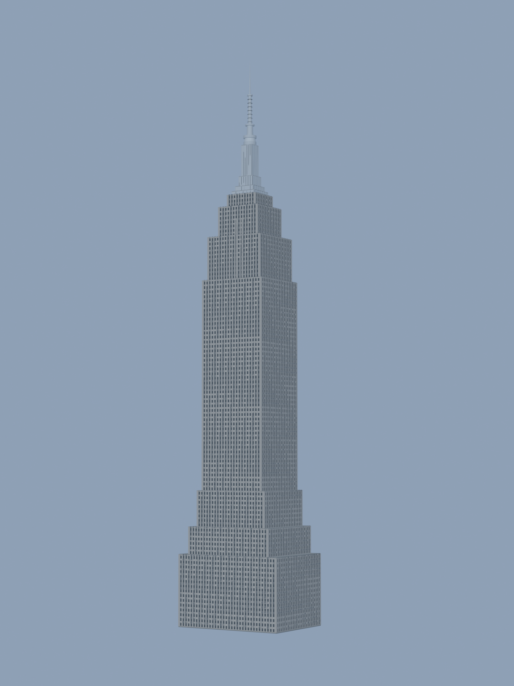

# Empire State Building

Development test 16, plugin **0.8.0**, source revision `cbd6d319d2da642a96fb3686d96df3e7c3eedb82`.

| Reference | Reconstruction |
| --- | --- |
|  |  |

[Download IFC](house.ifc) · [Assumptions and camera](reconstruction.json) ·
[Original validation report](validation.json) · [Publication metadata](example.json)

## Recorded evidence

- IFC: **PASS**.
- Fitted landmarks: **FAIL**, RMS **8.56 px**, maximum **18.20 px**, tolerance **5 px**.
- Appearance: **PASS**.
- Held-out landmarks: **0**. No independent photographic accuracy is established.

These are the original run's reports, not newly scored results. Read the report
for visual-review limits and outstanding discrepancies. Dimensions and hidden
geometry are assumptions from one view. This is not a survey model.

## Files

The IFC and comparison render are final delivery snapshots. The style sidecar
retains Blender appearance metadata; ordinary IFC readers use the IFC itself.
`observations.json` and `landmarks.json` retain the annotations and IFC bindings
behind the reported fit. `example.json` records the source revision and published
file hashes without machine-specific configuration.

Intermediate renders, logs, scripts, local setup files and client configuration
are intentionally omitted. This is an inspectable output package, not a complete
replay environment. The IFC bytes and their hashes are unchanged.

## Image credit

Reference photograph: Aleksei Kondratenko, 19 August 2020, Nikon Coolpix P900. [CC BY 4.0](https://creativecommons.org/licenses/by/4.0/). The reference bytes are unchanged.

Reference images are separate from the repository's software license.
