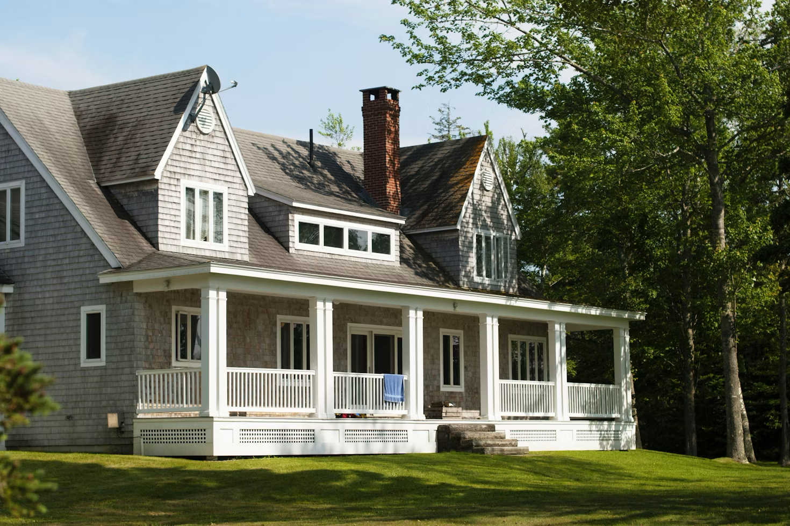
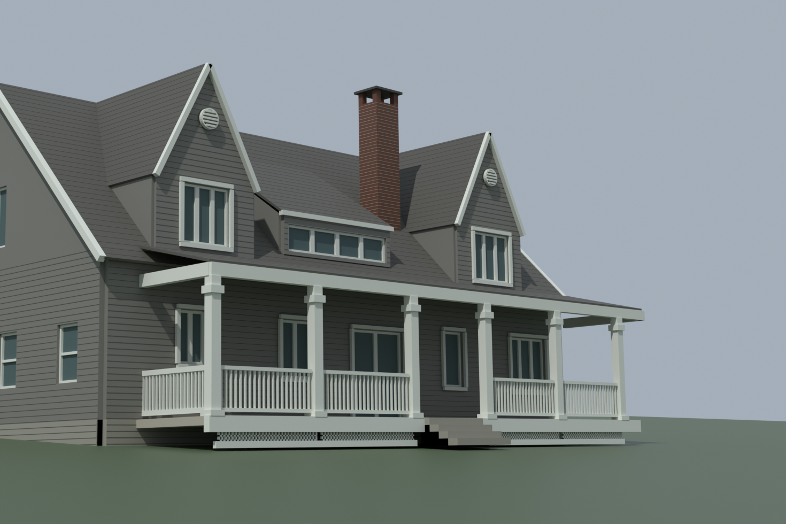

# Shingled house

| Reference | IFC reconstruction |
| --- | --- |
|  |  |

[Download IFC](house.ifc) · [Assumptions](reconstruction.json) · [Independent IFC review](review.json) · [Photographic evaluation](evaluation.json) · [File provenance](example.json)

Generated with **0.8.4-dev.2**. Two inferred floorplates, 32 windows and two doors with individual hosted openings. Roof forms, porch and materials follow the photograph. Scale, construction and unseen façades remain inferred. This run used 0.8.4-dev.2, before the final prism-winding fix: four plain foundation walls retain inconsistent face orientation. The source IFC is preserved, not silently repaired.

Fitted-landmark error: **8.51 px RMS / 15.18 px maximum**, against a 5 px tolerance. The recorded photographic verdict is **needs_refinement**. No held-out landmarks or silhouette mask were supplied. A pleasing render and a valid IFC structure do not establish survey accuracy.

The IFC and render are unchanged from the run. JSON paths are normalized for distribution. Original run validation is retained alongside the later independent review; consult both when assessing the model. The represented elements target approximate LOD 200, not a certified architectural deliverable. No invented room layouts or building services are included.

## Reference

Reference supplied from [Unsplash](https://images.unsplash.com/photo-1584738766473-61c083514bf4), under the [Unsplash License](https://unsplash.com/license). The photographer has not yet been identified. The PNG is the same input used for this reconstruction; its earlier source was an AVIF download. Image terms are separate from the repository's software licence.
