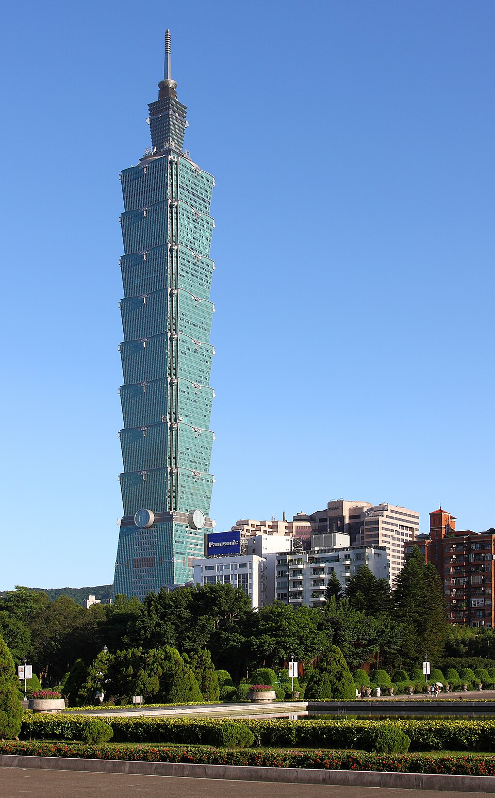
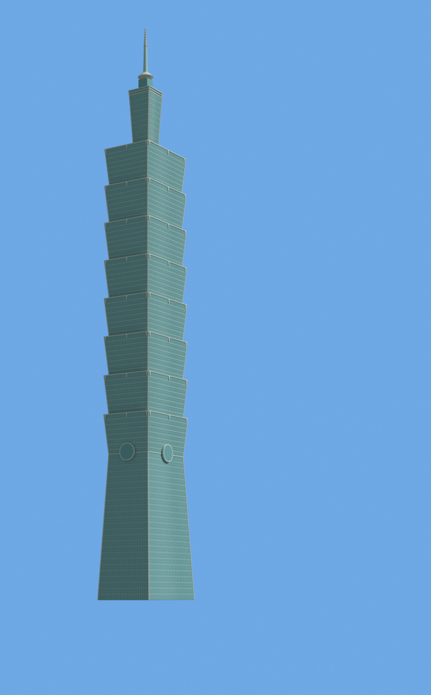

# Taipei 101

| Reference | IFC reconstruction |
| --- | --- |
|  |  |

[Download IFC](house.ifc) · [Assumptions](reconstruction.json) · [Independent IFC review](review.json) · [Photographic evaluation](evaluation.json) · [File provenance](example.json)

Generated with **0.8.4-dev.3**. 101 inferred floorplates and 44 curtain-wall assemblies. Repeated panels and members retain individual identities, type families and materials. Full EXPRESS validation and all 2,622 represented leaf elements passed conversion; floor winding and volumes were also checked. The assumed height is 508 m; rectangular floor footprints and hidden depth are estimates, not measured building plans.

Fitted-landmark error: **4.22 px RMS / 9.34 px maximum**, against a 5 px tolerance. The recorded photographic verdict is **needs_refinement**. No held-out landmarks or silhouette mask were supplied. A pleasing render and a valid IFC structure do not establish survey accuracy.

The IFC and render are unchanged from the run. JSON paths are normalized for distribution. Original run validation is retained alongside the later independent review; consult both when assessing the model. The represented elements target approximate LOD 200, not a certified architectural deliverable. No invented room layouts or building services are included.

## Reference

Reference: AngMoKio, edited by Mylius, [original photograph](https://commons.wikimedia.org/wiki/File:Taipei_101_2009_amk-EditMylius.jpg), [CC BY-SA 3.0](https://creativecommons.org/licenses/by-sa/3.0/). Image terms are separate from the repository's software licence.
